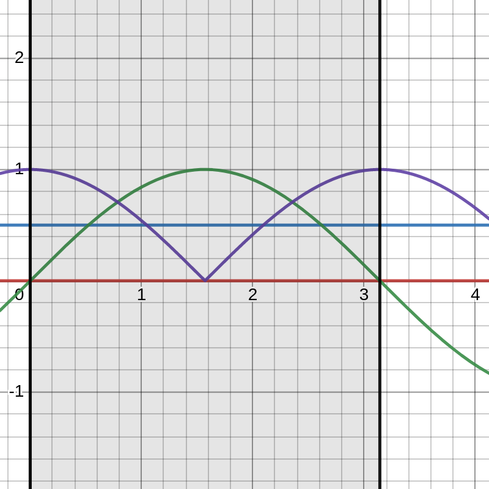

# fade-in-out-thing
Another simple arduino project. Using arduino's Pulse  Wave Modulation (PWM) to making fading lights

Yep, is one of those basic examples you find on books. I decided to try it out, but instead of just following what books says, I used cosine and sine functions as my deltas instead of some integer value. Reason is because with cos/sin functions you can change the phase of an individual light much easier. Bellow is a desmos graph that shows the two functions at (0 <= x <= pi). I had to use |cos(x)| because i didn't needed the negative side.

